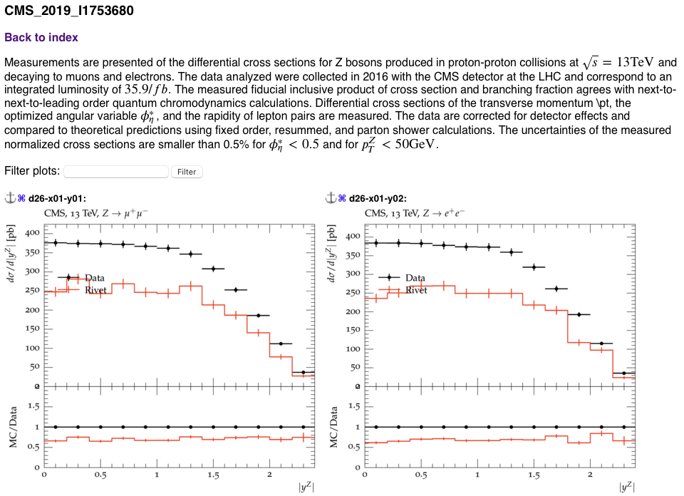
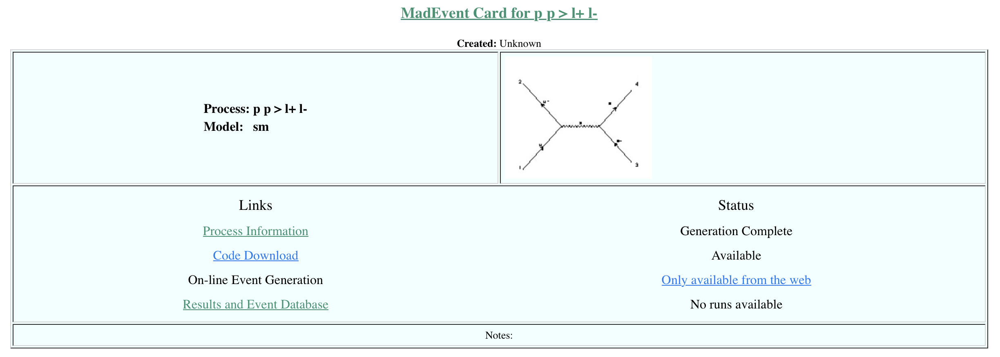
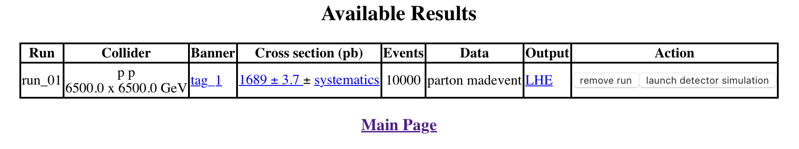
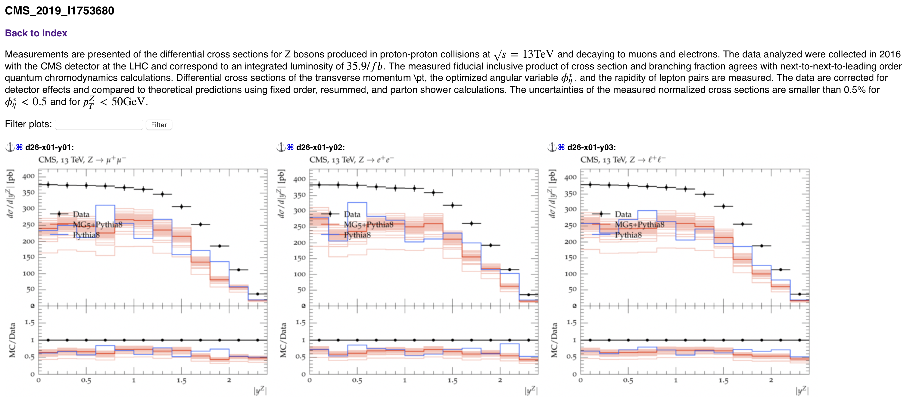
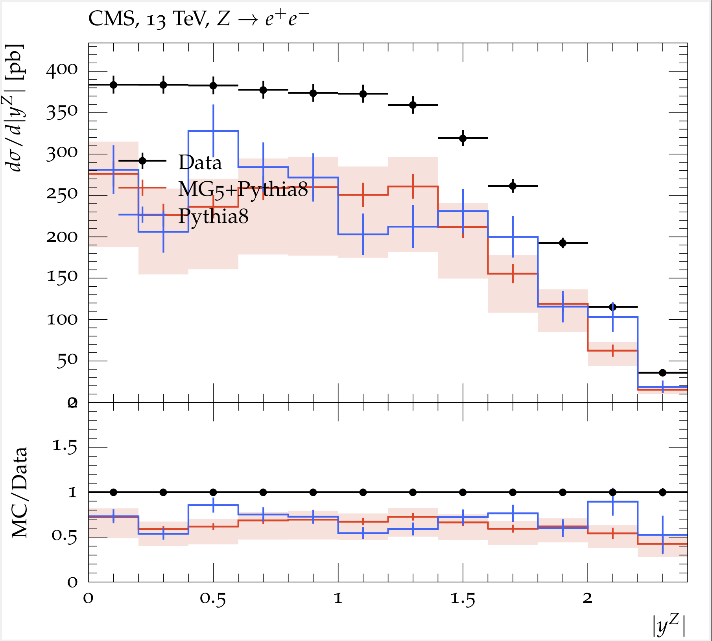

# Session 1 Examples

The purpose of this session is to introduce essential tools for making predictions at the Large Hadron Collider (LHC). Through a series of simple examples, you will learn the basics of Monte Carlo (MC) event generators, including how to generate events, store them, and analyse the results using a standard analysis toolchain. You will then apply this knowledge to explore some of the challenges that arise in the simulation of top quark pair production.

We will start by generating events with `Pythia8`, and analysing them and comparing the results to experimental data using `Rivet3`. We will then improve our predictions by upgrading the hard scattering component with the help of `MG5_aMC@NLO`.

## Event generation with `Pythia8`
Let us start with a very simple example. Our goal is to generate some events, inspect them, and save them in a file on hard-drive.

---
### Example 1: First $l^+l^-$ event
Let us start by generating some events with opposite-charge lepton pairs using `Pythia`'s `Python` interface. 

_This example includes a few `Python` code snippets; refer to the Appendix if you are unsure how to run them._

```python
# This is Python

# Import the Pythia module.
import pythia8

# Create a Pythia object.
pythia = pythia8.Pythia()

# Configure the Pythia object.
pythia.readString("WeakSingleBoson:ffbar2gmZ = on")  # Switch on pp > photon/Z
pythia.readString("23:onMode = off") # Turn off all Z decays ... 
pythia.readString("23:onIfAny = 11 13") # ... except to electrons and muons
pythia.readString("Beams:eCM = 13000.") # Set 13 TeV CM energy.

# Initialize, incoming pp beams are default.
pythia.init()

# Generate an(other) event. Fill event record.
pythia.next()
```

The first few events will be printed to the standard output (subject to the `Next:numberShowEvent` setting), and further events can be printed using `pythia.event.list()`. The event will be saved in `pythia.event`. We can print the number of particles in the event record or iterate over them and print all occurrences of the $Z$ boson, for example:
```python
# This is Python

# Print the number of particles in the event
print(pythia.event.size())

# Iterate over particles in the event
for particle in pythia.event:
   # If the particle is the Z boson
   if (particle.id() == 23):
      # Print a message
      print("found Z boson: {}".format(particle.p()))
```

The event record contains anywhere from a few hundred to a couple of thousand entries. This is because, in addition to the hard event $pp \to \gamma/Z \to l^+ l^-$, `Pythia8` adds initial and final state parton showers (ISR & FSR), multi-parton interactions (MPI), hadronization and hadron decays, beam remnants, etc.. Moreover, the same particle can appear multiple times in the event record at different stages of the collision. To visually verify our settings for the hard interaction, it can be useful to disable the other stages:

```python
# This is Python

# Pass settings to Pythia
pythia.readString("PartonLevel:FSR = off") # disable final-state radiation
pythia.readString("PartonLevel:ISR = off") # disable initial-state radiation
pythia.readString("PartonLevel:MPI = off") # disable multi-parton interactions 
pythia.readString("PartonLevel:Remnants = off") # disable beam remnants
pythia.readString("HadronLevel:all = off") # disable hadronization
pythia.readString("Check:event = off") # disable event checking (required when beam remnants are disabled)
```
Note that after changing these settings, the `pythia` object needs to be re-initialised with `pythia.init()`. Regenerating the event with everything disabled except for the hard scattering yields:
```
 --------  PYTHIA Event Listing  (complete event)  ---------------------------------------------------------------------------------
 
    no         id  name            status     mothers   daughters     colours      p_x        p_y        p_z         e          m 
     0         90  (system)           -11     0     0     0     0     0     0      0.000      0.000      0.000  13000.000  13000.000
     1       2212  (p+)               -12     0     0     3     0     0     0      0.000      0.000   6500.000   6500.000      0.938
     2       2212  (p+)               -12     0     0     4     0     0     0      0.000      0.000  -6500.000   6500.000      0.938
     3         -2  (ubar)             -21     1     0     5     0     0   101      0.000      0.000      0.137      0.137      0.000
     4          2  (u)                -21     2     0     5     0   101     0      0.000      0.000   -213.621    213.621      0.000
     5         23  (Z0)               -22     3     4     6     7     0     0      0.000      0.000   -213.484    213.758     10.812
     6         13  mu-                 23     5     0     0     0     0     0     -1.182      2.385    -13.742     13.998      0.106
     7        -13  mu+                 23     5     0     0     0     0     0      1.182     -2.385   -199.743    199.760      0.106
                                   Charge sum:  0.000           Momentum sum:      0.000      0.000   -213.484    213.758     10.812

 --------  End PYTHIA Event Listing  -----------------------------------------------------------------------------------------------
```

A sample of $n$ events can be generated by repeatedly calling `pythia.next()` $n$ times.

---
### Example 2: $l^+l^-$ event sample

The `Python` interface is useful for exploring `Pythia8`'s capabilities. However, if we want to pass the generated events along, we need to switch to its default operating mode: compiled code linked against `libpythia8`.

_This example includes a couple of `C++` snipets. Instructions on how to compile and link these against `libpythia8` and `HepMC3` are provided in the Appendix._

The following code snippet demonstrates a `C++` program that configures `Pythia8` in the same way as Example 1. Instead of generating just one event, this program generates one hundred events and writes them to a file named `DY.hepmc` in `HepMC3` format.

```c++
// This is C++

#include "Pythia8/Pythia.h"
#include "Pythia8Plugins/HepMC3.h"
using namespace Pythia8;

int main() {

  // Interface for conversion from Pythia8::Event to HepMC event.
  // Specify file where HepMC events will be stored.
  Pythia8ToHepMC toHepMC("DY.hepmc");

  // Generator. Process selection. LHC initialization.
  Pythia pythia;
  pythia.readString("WeakSingleBoson:ffbar2gmZ = on");  // Switch on pp > photon/Z
  pythia.readString("23:onMode = off"); // Turn off all Z decays ...
  pythia.readString("23:onIfAny = 11 13"); // ... except to electrons and muons
  pythia.readString("Beams:eCM = 13000."); // Set 13 TeV CM energy.

  // If Pythia fails to initialize, exit with error.
  if (!pythia.init()) return 1;

  // Begin event loop. Generate event. Skip if error.
  for (int iEvent = 0; iEvent < 100; ++iEvent) {
    if (!pythia.next()) continue;

    // Construct new empty HepMC event, fill it and write it out.
    toHepMC.writeNextEvent( pythia );

  // End of event loop. Statistics.
  }
  pythia.stat();

  // Done.
  return 0;
}
```
The content of `DY.hepmc` is human readable and I invite you to look at it. 
```bash
# This is shell

# Inspect the DY.hepmc file
dexec less DY.hepmc
```

If you want to learn more `HepMC3` file format, have a look in the Appendix.

---
### Example 3: Fancier version of Example 2
The program from Example 2 can be further improved:
1. Instead of passing commands to `Pythia8` using the `readString` method, you can also use a command file, which is parsed with the `readFile` method.
   ```c++
   // This is C++
   pythia.readFile("<filename>.cmnd");
   ```
   where the content of the `<filename>.cmnd` file would be for example:
   ```
   WeakSingleBoson:ffbar2gmZ = on ! Switch on pp > photon/Z
   23:onMode = off ! Turn off all Z decays ...
   23:onIfAny = 11 13 ! ... except to electrons and muons
   Beams:eCM = 13000 ! Set 13 TeV CM energy.
   ```

2. The name of the output file, and optionally also the _command file_, could be passed as command line arguments. For example
   ```c++
   // This is C++
   int main(int argc, char* argv[]) {

     // Check that correct number of command-line arguments
     if (argc != 2) {
       cerr << " Unexpected number of command-line arguments. \n You are"
            << " expected to provide one output file name. \n"
            << " Program stopped! " << endl;
       return 1;
     }
     // Confirm that external files will be used for input and output.
     cout << " <<< \n >>> HepMC events will be written to file "
          << argv[1] << " <<< \n" << endl;

     // Interface for conversion from Pythia8::Event to HepMC event.
     // Specify file where HepMC events will be stored.
     Pythia8ToHepMC toHepMC(argv[1]);
   ```
---

## Analysing events with `Rivet3`

`Rivet3` provides a framework for data analysis over an event sample. It offers methods to tag particles of interest, apply cuts, calculate kinematic observables, and create histograms. This makes it a universal tool for bridging theoretical and experimental communities. Notably, `Rivet` is actively used: many LHC experiments encourage their analysis teams to implement the event selection used in measurements within `Rivet` and even provide the relevant data. Consequently, theorists primarily need to focus on providing event samples.

A list of all available analyses can be found on the [`Rivet` website](https://rivet.hepforge.org/analyses/). The following analyses will be useful in the remainder of this tutorial:
- `CMS_2019_I1753680`: measurements of the differential cross sections for $Z$ bosons produced in proton-proton collisions at $\sqrt{s}=13$ TeV, decaying to muons and electrons. The data analysed were collected in 2016 with the CMS detector at the LHC and correspond to an integrated luminosity of 35.9/fb. It provides differential cross sections for the dilepton pair, most notably the transverse momentum ($p_t$) and the rapidity ($y$).
- `CMS_2016_I1413748`: measurements of the top quark-antiquark spin correlation and the top quark polarization for top pairs produced in proton-proton collisions at $\sqrt{s}=8$ TeV. The data correspond to an integrated luminosity of 19.5/fb
collected with the CMS detector at the LHC. The measurements are performed using events with two oppositely charged leptons (electrons or muons) and two or more jets, where at least one of the jets is identified as originating from a bottom quark. The spin correlations and polarization are extracted from the angular distributions of the two selected leptons, both inclusively and differentially, with respect to the invariant mass, rapidity, and transverse momentum of the $t\bar{t}$ system.
- `ATLAS_2019_I1759875`: ttbar 13TeV 
- `CMS_2018_I1703993`: ttbar 13TeV

---
### Example 4: Analysing $l^+l^-$ event sample with `Rivet`
The `.hepmc` file generated in the previous example can be directly used as input for `Rivet`:
```bash
# This is shell

# Launch the analysis 
dexec rivet --analysis=CMS_2019_I1753680 DY.hepmc
```
Here, the `--analysis` option specifies which analysis to apply to the event sample. Running this command will create a `Rivet.yoda` file, which contains the histograms of the observables defined in the specified analysis.

Note that generating only 100 events will not be sufficient to construct a reliable differential distribution, as the statistical uncertainty in each bin is proportional to $1/\sqrt{N}$, where $N$ is the number of entries in that bin. To obtain meaningful results, Example 2 should be modified to generate a larger event sample.

The results stored in the `.yoda` file can be plotted using the following command:
```bash
# This is shell

# Do the plots
dexec rivet-mkhtml --err Rivet.yoda
```
This command generates a `rivet-plots` directory containing all the plots, along with a simple HTML website that compiles them in `index.html`. You can open this file in your favourite browser. The `--err` switch switches on the plotting of the MC errorbars (which is very invaluable for samples with low stats). 

Here’s what you should see:


---

### Customizing `Rivet` Plots

1. __Modifying Plotting Styles__: You can customize the plotting style (e.g., line style, legend label) by adding colon-separated modifiers after the `.yoda` file name. For example:
   ```bash
   # This is shell

   # Do the plots
   dexec rivet-mkhtml Rivet.yoda:"LineColor=blue:LineWidth=2:Label=Pythia8"
   ```
   For more details, refer to the [`plotting.md`]](https://gitlab.com/hepcedar/rivet/-/blob/rivet-3.1.8/doc/tutorials/plotting.md) file from the [`Rivet` tutorials directory](https://gitlab.com/hepcedar/rivet/-/blob/rivet-3.1.8/doc/tutorials).

2. __Configuring Plotting Area Settings__: You can adjust plotting area settings (e.g., sizes, limits, axis labels) using a configuration file:
   ```bash
   # This is shell

   # Do the plots
   dexec rivet-mkhtml -c plot.conf Rivet.yoda
   ```
   In the example below we adjust the ratio plot $y$-axis limits using the `plot.conf` file:
   ```
   # BEGIN PLOT .*
   RatioPlotYMin=0
   RatioPlotYMax=2
   # END PLOT
   ```
   More information is available in the [`makeplots.md`]](https://gitlab.com/hepcedar/rivet/-/blob/rivet-3.1.8/doc/tutorials/makeplots.md) file from the [`Rivet` tutorials directory](https://gitlab.com/hepcedar/rivet/-/blob/rivet-3.1.8/doc/tutorials).

3. __Using Matplotlib for Plotting__: `Rivet` also supports plotting with `matplotlib` in `Python` using the `rivet-mkhtml-mpl` command, see [here](https://gitlab.com/hepcedar/rivet/-/blob/f12ca0cdb2163f29f725d6cbb4cee3a59c766fcb/doc/tutorials/customizeplots.md).

---
### Example 5: Using FIFO pip in Examples 2 and 4
When showering events with MPI and hadronization enabled, the event records can become very large. For instance, the sample of 100k events from Example 2 occupies about 18GB of hard drive space. If you don't need to keep the full output but only need to pass it to an analysis program on-the-fly, using a `FIFO` pipe is recommended.

Here’s how you can set up a `FIFO` pipe to handle this:
```bash
# This is shell
# Setup a FIFO pipe
mkfifo DY.hepmc
# Launch the generation of the events 
dexec ./mymain131 &
# Launch the analysis of the events
dexec rivet --analysis=CMS_2019_I1753680 DY.hepmc
```
In this setup, `mymain131` is the executable created in Example 2. The event records are written to a `FIFO` pipe named `DY.hepmc`. Data generated by `mymain131` is buffered temporarily in the `FIFO` pipe until it is read by `rivet`. Once the data is read, it is removed from the buffer, allowing `mymain131` to continue generating new data. This approach ensures a smooth data flow between the programs without using excessive hard drive space.

---

## Generating events with `MG5_aMC@NLO`+`Pythia`

`Pythia8` provides hard-scattering amplitudes for a limited set of processes, and only at leading-order (LO) accuracy. However, you can replace its hard-scattering component by supplying `Pythia8` with events generated by another program. `Pythia8` then supplements parton showers, multiple parton interactions (MPIs), and other effects.

Several tools can generate events ready for _showering_, including `Herwig`, `MG5_aMC@NLO`, `POWHEG BOX`, `Sherpa`, `Whizard`, and others. In this part of the tutorial, we will focus on `MG5_aMC@NLO`, a versatile program that generates events for any Standard Model process and beyond, also including radiative corrections.

We will go through an example of generating $l^+l^-$ events using `MG5_aMC@NLO` and then _showering_ them with `Pythia8`. While the typical use case involves replacing the hard-scattering component to improve it by include radiative corrections, off-shell effects, or subleading contributions, our goal here is merely to illustrate the process.

---
### Example 6: Generating the $pp \to l^+ l^-$ process with `MG5_aMC@NLO`
The typical workflow in `MG5_aMC@NLO` involves generating a process directory that contains `fortran` sources implementing scattering amplitudes. These sources can then be used to calculate differential cross sections and generate unweighted events.

You can perform both steps using the `mg5_aMC` `Python` program. To start, launch it with:
```bash
# This is shell

# Launch mg5_aMC
dexec mg5_aMC
```
This call opens an interactive terminal where you can enter commands. To generate the process directory, type the following:
```
# This is mg5_aMC shell

# Generate the amplutides
generate p p > l+ l- 

# Save them to hdd
output l+l-
```
These commands will create the process and save it in the `l+l-` directory. Inside this directory, you will find `index.html`. Opening this file with your preferred browser will provide information about the process, including contributing channels and Feynman diagrams (see the "Process Information" link):


---
### Example 7: Generating the $pp \to l^+ l^-$ event sample with `MG5_aMC@NLO`
The next step is to generate events. Launch the interactive `mg5_aMC` terminal again and type:
```
# This is mg5_aMC shell

# Launch the calculation
launch l+l- 
```
Here, `l+l-` is the name of the process directory created in Example 6.

The program will ask if you want to postprocess the events in any way (e.g., shower them, run detector simulation, decay resonances). At this point, refuse all these options by simply pressing Enter, as we will manually shower the events with `Pythia8` afterwards.

Next, the program will ask whether you want to edit:
- `param_card.dat`: Controls physics inputs like particle masses and widths, or couplings.
- `run_card.dat`: Controls center-of-mass energy, PDFs, number of events, generation cuts, and more.

Leave everything as is. The program will then proceed to calculate the differential cross sections and generate 10k events.

The "Results and Event Database" link (see the website generated in the previous example) will now contain an entry with information on this run:


The events are stored in the `LHE` format (compressed with `zlib` on-the-fly, hence the `.lhe.gz` suffix). They can be downloaded from the website or found in `./l+l-/Events/run_01/unweighted_events.lhe.gz`. More information about this file format can be found in the appendix.

Note: `zlib` compressed files don't necessarily need unpacking. If you inspect them with command line tools like `cat`, `less`, `grep`, etc., and your system complains that the file is binary, you can often use "z-versions" of these commands instead (e.g., `zcat`, `zless`, `zgrep`) that can read the file without unpacking it. If need be, my preferred method to unpack the file is (which preserves the original file unlike `gunzip`):
```bash
# This is shell

# Print the events to stdout and pipe them to a file
dexec zcat l+l-/Events/run_01/unweighted_events.lhe.gz > unweighted_events.lhe
```
---

There is a lot more one can do with `MG5_aMC@NLO`, to learn more please follow the tutorial available in the `mg5_aMC` program available via
```
# This is mg5_aMC shell

# Launch the tutorial
tutorial
```

--- 
### Example 8: Showering `MG5_aMC@NLO` events with `Pythia8`

The following example program instructs `Pythia8` to load events from an `LHE` file and then to _shower_ them.
```c++
// This is C++

#include "Pythia8/Pythia.h"
#include "Pythia8Plugins/HepMC3.h"
using namespace Pythia8;

int main() {

  // Interface for conversion from Pythia8::Event to HepMC event.
  // Specify file where HepMC events will be stored.
  Pythia8ToHepMC toHepMC("DY-MG5.hepmc");

  // LHE event loader.
  Pythia pythia;
  pythia.readString("Beams:frameType = 4"); // Switch on loading of LHE files
  pythia.readString("Beams:LHEF = l+l-/Events/run_01/unweighted_events.lhe.gz"); // set the LHE path and filename
  pythia.readString("TimeShower:ptMaxMatch = 1"); // use SCALUP for FSR
  pythia.readString("SpaceShower:ptMaxMatch = 1"); // use SCALUP for ISR

  // If Pythia fails to initialize, exit with error.
  if (!pythia.init()) return 1;

  // Begin event loop. Shower event. Skip if error.
  while (!pythia.info.atEndOfFile()) {
    if (!pythia.next()) continue;

    // Construct new empty HepMC event, fill it and write it out.
    toHepMC.writeNextEvent( pythia );

  // End of event loop. Statistics.
  }
  pythia.stat();

  // Done.
  return 0;
}
```
The event loop now goes on until all events in the `unweighted_events.lhe.gz` file have been read (see `pythia.info.atEndOfFile()`). The parton shower typically starts at the scale of the hard process. The choice of this scale is not unique, and correspondingly `Pythia8` offers several prescriptions through the `ptMaxMatch` setting. The value `ptMaxMatch = 1` instructs `Pythia8` to read the shower starting scale from the `LHE` file. There its value, in the `LHE` lingo known as `SCALUP`, has already been calculated by the hard event generator.

Note that `Pythia8` can load `zlib` compressed `LHE` files. 

---
### Example 9: Comparing `Pythia8` and `MG5_aMC@NLO+Pythia8` predictions

Once we analysed the event samples with `Rivet3` we can compare the two predicitions to each other and to data.
```bash
# This is bash 

# Plot two yoda files
dexec rivet-mkhtml DY-MG5.yoda:"Title=MG5+Pythia8" DY.yoda:"Title=Pythia8" -c plot.conf
```
Here `DY-MG5.yoda` and `DY.yoda` contain the results obtained by analysing `MG5_aMC@NLO+Pythia8` with the `rivet` program (see Example 4).



We note that the `MG5_aMC@NLO` prediction is drawn with a multitude of lines. This occurs because `MG5_aMC@NLO` includes scale and PDF variations in the `LHE` events -- each event contains seven weights for the usual 7pt $\mu_f$, $\mu_r$ variation, as well as one weight for each PDF error member (and more). Without specific instructions on how to plot these weights, `Rivet3` simply renders all the lines.

Like this, we disable all but the first weight:
```bash
# This is bash

# Plot two yoda files, select single weight
dexec rivet-mkhtml --errs results/DY-MG5.yoda:"Title=MG5+Pythia8:Variations=none"  results/DY.yoda:"Title=Pythia8" -c plot.conf

```

And like this, we instruct `Rivet` to render an envelope of a selection of weights into a scale variation band: 
```bash
# This is bash

# Plot two yoda files, with a central curve and a scale variation band
dexec rivet-mkhtml --errs results/DY-MG5.yoda:"Title=MG5+Pythia8:Variations=none:BandComponentEnv=1,6,11,16,25,30,35,40"  results/DY.yoda:"Title=Pythia8" -c plot.conf
```

Which weights to select (`1,6,...`) can be figured out by looking at the `.lhe` file:
```
...
<initrwgt>
<weightgroup name="Central scale variation" combine="envelope">
<weight id="1" MUR="0.5"  MUF="0.5"  PDF="247000" > MUR=0.5 MUF=0.5  </weight>
<weight id="2" MUR="0.5"  MUF="0.5"  DYN_SCALE="1"  PDF="247000" > MUR=0.5 MUF=0.5 dyn_scale_choice=sum pt  </weight>
<weight id="3" MUR="0.5"  MUF="0.5"  DYN_SCALE="2"  PDF="247000" > MUR=0.5 MUF=0.5 dyn_scale_choice=HT  </weight>
<weight id="4" MUR="0.5"  MUF="0.5"  DYN_SCALE="3"  PDF="247000" > MUR=0.5 MUF=0.5 dyn_scale_choice=HT/2  </weight>
<weight id="5" MUR="0.5"  MUF="0.5"  DYN_SCALE="4"  PDF="247000" > MUR=0.5 MUF=0.5 dyn_scale_choice=sqrts  </weight>
<weight id="6" MUR="0.5"  MUF="1.0"  PDF="247000" > MUR=0.5  </weight>
<weight id="7" MUR="0.5"  MUF="1.0"  DYN_SCALE="1"  PDF="247000" > MUR=0.5 dyn_scale_choice=sum pt  </weight>
<weight id="8" MUR="0.5"  MUF="1.0"  DYN_SCALE="2"  PDF="247000" > MUR=0.5 dyn_scale_choice=HT  </weight>
<weight id="9" MUR="0.5"  MUF="1.0"  DYN_SCALE="3"  PDF="247000" > MUR=0.5 dyn_scale_choice=HT/2  </weight>
<weight id="10" MUR="0.5"  MUF="1.0"  DYN_SCALE="4"  PDF="247000" > MUR=0.5 dyn_scale_choice=sqrts  </weight>
...
```

This is what the plot looks like with a scale variation band:



## Appendix

Here we provide more information on topics we may have assumed that you already knew including a couple of useful references. 

### PDG IDs

The Particle Data Group (PDG) assigns unique identifiers, known as PDG IDs, to all elementary particles and many composite particles. These IDs are standardized numerical codes used in particle physics to unambiguously identify particles in simulations, experiments, and theoretical studies. PDG IDs are widely used in particle physics software.

The PDG ID is a signed integer that encodes the particle’s properties, such as its type (quark, lepton, boson), charge, and generation. For example, positive values are typically assigned to particles, while negative values denote their corresponding antiparticles.

Here is a list of PDG IDs for Standard Model Particles

| Particle              | Symbol     | PDG ID |
|-----------------------|------------|--------|
| Down quark            | $d$        | 1      |
| Up quark              | $u$        | 2      |
| Strange quark         | $s$        | 3      |
| Charm quark           | $c$        | 4      |
| Bottom quark          | $b$        | 5      |
| Top quark             | $t$        | 6      |
| Electron              | $e^-$      | 11     |
| Electron neutrino     | $\nu_e$    | 12     |
| Muon                  | $\mu^-$    | 13     |
| Muon neutrino         | $\nu_\mu$  | 14     |
| Tau                   | $\tau^-$   | 15     |
| Tau neutrino          | $\nu_\tau$ | 16     |
| Gluon                 | $g$        | 21     |
| Photon                | $\gamma$   | 22     |
| Z boson               | $Z$        | 23     |
| W boson (positive)    | $W^+$      | 24     |
| Higgs boson           | $H$        | 25     |

#### Examples

- **Electron (PDG ID = 11):** The electron is a negatively charged lepton. Its PDG ID is 11, and its antiparticle, the positron, has a PDG ID of -11.
- **Top quark (PDG ID = 6):** The top quark is the heaviest quark in the Standard Model, and its PDG ID is 6. Its antiparticle has a PDG ID of -6.

### `Pythia` (excerpt from the [Pythia 8.3 worksheet](https://pythia.org/pdfdoc/worksheet8312.pdf))

The `Pythia 8.3` program is a standard tool for the generation of high-energy collisions (specifically, it focuses on centre-of-mass energies greater than about 10 GeV), comprising a coherent set of physics models for the evolution from a few-body high-energy ("hard") scattering process to a complex multihadronic final state. The particles are produced in vacuum. Simulation of the interaction of the produced particles with detector material is not included in Pythia but can, if needed, be done by interfacing to external detector-simulation codes.
The `Pythia 8.3` code package contains a library of hard interactions and models for initial- and final-state parton showers, multiple parton-parton interactions, beam remnants, string fragmentation and particle decays. It also has a set of utilities and interfaces to external programs.

### `MG5_aMC@NLO` (excerpt from the [MG5_aMC@NLO website](https://launchpad.net/mg5amcnlo))

`MadGraph5_aMC@NLO` is a framework that aims at providing all the elements necessary for SM and BSM phenomenology, such as the computations of cross sections, the generation of hard events and their matching with event generators, and the use of a variety of tools relevant to event manipulation and analysis. Processes can be simulated to LO accuracy for any user-defined Lagrangian, an the NLO accuracy in the case of models that support this kind of calculations -- prominent among these are QCD and EW corrections to SM processes. Matrix elements at the tree- and one-loop-level can also be obtained.

`MadGraph5_aMC@NLO` is the new version of both MadGraph5 and aMC@NLO that unifies the LO and NLO lines of development of automated tools within the MadGraph family. It therefore supersedes all the MadGraph5 1.5.x versions and all the beta versions of aMC@NLO. As such, the code allows one to simulate processes in virtually all configurations of interest, in particular for hadronic and e+e- colliders; starting from version 3.2.0, the latter include Initial State Radiation and beamstrahlung effects.

### `Rivet` (excerpt from the [Rivet website](https://rivet.hepforge.org/))

The `Rivet` toolkit (Robust Independent Validation of Experiment and Theory) is a system for validation of Monte Carlo event generators. It provides a large (and ever growing) set of experimental analyses useful for MC generator development, validation, and tuning, as well as a convenient infrastructure for adding your own analyses.

`Rivet` is the most widespread way by which analysis code from the LHC and other high-energy collider experiments is preserved for comparison to and development of future theory models. It is used by phenomenologists, MC generator developers, and experimentalists on the LHC and other facilities.

### `HepMC3` (excerpt from from the [HepMC3 website](https://gitlab.cern.ch/hepmc/HepMC3))

`HepMC3` is a new version of the `HepMC` event record. It uses shared pointers for in-memory navigation and the POD concept for persistency.

`HepMC` is a data format and corresponding software library designed to store and manipulate event records in high-energy physics simulations. It is widely used in particle physics for representing the events generated by MC event generators, such as Pythia, Herwig, and MadGraph.

The first few lines of the `DY.hepmc` file from Example 2, but generated with only hard scattering enabled, look like this:
```
HepMC::Version 3.02.07
HepMC::Asciiv3-START_EVENT_LISTING
W Weight
E 0 4 7
U GEV MM
W 1.0000000000000000000000e+00
A 0 GenCrossSection 9.28704901e+03 9.28704901e+03 -1 -1
A 0 GenPdfInfo -2 2 2.10456285e-05 3.28648051e-02 1.08115966e+01 2.73311568e+00 5.91053583e-01 0 0
A 0 alphaQCD 0.196444505005227
A 0 alphaQED 0.0076330162100602
A 0 event_scale 10.8115965996342
A 2 flow1 0
A 4 flow1 101
A 2 flow2 101
A 4 flow2 0
A 0 signal_process_id 221
P 1 0 2212 0.0000000000000000e+00 0.0000000000000000e+00 6.4999999322807234e+03 6.5000000000000000e+03 9.3827000000000005e-01 4
P 2 1 -2 0.0000000000000000e+00 0.0000000000000000e+00 1.3679658520103094e-01 1.3679658520103094e-01 0.0000000000000000e+00 21
P 3 0 2212 0.0000000000000000e+00 0.0000000000000000e+00 -6.4999999322807234e+03 6.5000000000000000e+03 9.3827000000000005e-01 4
P 4 3 2 0.0000000000000000e+00 0.0000000000000000e+00 -2.1362123342012433e+02 2.1362123342012433e+02 0.0000000000000000e+00 21
V -3 0 [2,4]
P 5 -3 23 0.0000000000000000e+00 0.0000000000000000e+00 -2.1348443683492329e+02 2.1375803000532534e+02 1.0811596599634182e+01 22
V -4 0 [5] @ 0.0000000000000000e+00 0.0000000000000000e+00 -1.3793324689150972e-12 1.3811001665927541e-12
P 6 -4 13 -1.1816265629138398e+00 2.3852070816818842e+00 -1.3741902648092829e+01 1.3997732194250242e+01 1.0566000000000000e-01 1
P 7 -4 -13 1.1816265629138398e+00 -2.3852070816818842e+00 -1.9974253418682008e+02 1.9976029781106473e+02 1.0566000000000000e-01 
```
Here, `E 0` indicates the beginning of the first event (numbered from 0), followed by the number of vertices (plus 2) and the number of particles. Particle entries begin with `P` and vertex entries with `V`, each followed by an index. Each particle record contains information about the particle, such as the PDG ID and momentum, while each vertex record lists the incoming particles in square brackets.


### `LHE` 

The `LHE` (Les Houches Event) file format is a standardized format used in high-energy physics to store information about the events generated by MC event generators. It was developed as part of the Les Houches Accords, which aim to improve the interoperability between different tools and software used in particle physics.

The `.lhe` files look something like this 
```
<LesHouchesEvents version="xy">
<header>
  <!-- Optional information like the process, PDF, scale settings, etc. -->
  <init>
    2212 2212 6.500000e+03 6.500000e+03 0 0 247000 247000 -4 1
    1.688680e+03 3.705036e+00 1.688680e+03 1
  </init>
</header>
<event>
       5      1 +1.6886800e+03 9.22950200e+01 7.54677100e-03 1.29738700e-01
       -2 -1    0    0    0  501 -0.0000000000e+00 +0.0000000000e+00 +5.3771879862e+00 5.3771879862e+00 0.0000000000e+00 0.0000e+00 -1.0000e+00
        2 -1    0    0  501    0 +0.0000000000e+00 -0.0000000000e+00 -3.9604206752e+02 3.9604206752e+02 0.0000000000e+00 0.0000e+00 1.0000e+00
       23  2    1    2    0    0 +0.0000000000e+00 +0.0000000000e+00 -3.9066487954e+02 4.0141925551e+02 9.2295019314e+01 0.0000e+00 0.0000e+00
      -11  1    3    3    0    0 -4.0335354915e+01 -2.2291993046e+01 -2.0573340903e+02 2.1083194587e+02 0.0000000000e+00 0.0000e+00 -1.0000e+00
       11  1    3    3    0    0 +4.0335354915e+01 +2.2291993046e+01 -1.8493147051e+02 1.9058730964e+02 0.0000000000e+00 0.0000e+00 1.0000e+00
</event>
</LesHouchesEvents>
```
The `<init>` block contains information about the beams (incoming particles), their energies, ...
The numbers 2212 2212 represent the PDG IDs of the incoming particles, which are protons in this case.
6500 6500 are the beam energies in GeV.
The remaining numbers can correspond to PDF IDs, factorization scales, and other relevant settings.

Each `<event>` block contains the details of one simulated event.
The first line after `<event>` summarizes the event:
- 5: The number of particles in the event.
- +1.6886800e+03: An event weight.
- 9.22950200e+01: The hard scale in the event.
- etc.

Each subsequent line describes a particle in the event. These entries include:
- PDG ID: The particle's PDG code (e.g., -1 for a down quark, 1 for an up quark).
- Status Code: Indicates the particle's status in the event (e.g., initial state, final state, intermediate).
- Parent 1 and Parent 2: Indices of the parent particles that produced this particle.
- Daughters: Indices of the particles produced by this particle (if any).
- Momentum (px, py, pz, E, m): The particle's 4-momentum (momentum components in GeV, energy in GeV, and mass in GeV).
- Spin Information: (optional) Spin/helicity information.

## Running Python with the `mc-tutorial` container 

- run `python` interpreter terminal
   ```
   docker exec -it mc-tutorial python
   ```
   type command and execute them there. The `-it` flag ensures the interactive mode is invoked, otherwise the command just exits.

- save the code to a source file `<fname>.py` and run
   ```
   docker exec mc-tutorial python <fname>.py
   ``` 
   The `-it` flag is not necessary, but won't hurt. 

## Compiling `Pythia8` programs with the `mc-tutorial` container 

Here we assume that the directory you work in is the same as the working directory used during the creation of the container. Otherwise, make use of the `-w` flag to tell docker the current working directory.

1. Get the `Makefile` from the container 
   ```
   docker exec mc-tutorial cat /usr/local/share/Pythia8/examples/Makefile > Makefile
   docker exec mc-tutorial cat /usr/local/share/Pythia8/examples/Makefile.inc > Makefile.inc
   ```
2. a. If you want your progam to be linked against `libpythia8` then you can simply name your source file `mymainNN.cc` where NN is between 01 and 99 and run
   ```
   docker exec mc-tutorial make mymainNN
   ```
   b. If also need linking against `HepMC3` then name your source code as you wish, for example `mysource.cc`. Then you need to modify the `Makefile` by replacing the line 100 
   ```
   main131 main132 main133 main134 main135: $(PYTHIA) $$@.cc
   ```
   by 
   ```

