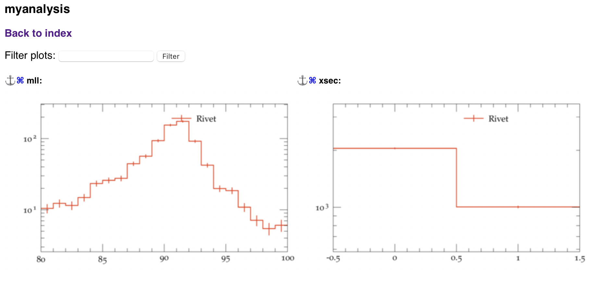
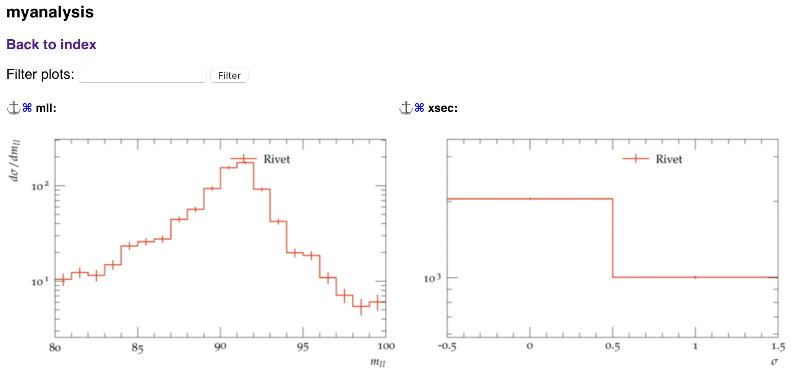

# Session 2 Examples

We introduce yet another hard event generator, `POWHEG BOX`, and discuss how hard events at next-to-leading order (NLO) accuracy can be consistently _showered_ with `Pythia8`. We will also explain how to write and build a custom analysis in `Rivet3`.

## NLO+PS matching with `POWHEG BOX`

`POWHEG BOX` is a general-purpose computational framework used in high-energy physics to generate events with next-to-leading-order (NLO) accuracy. It is an implementation of the POWHEG (Positive Weight Hardest Emission Generator) method, which was developed to improve the accuracy of event simulations by combining NLO perturbative QCD calculations with parton shower simulations.

The `POWHEG BOX` code is structured differently from other Monte Carlo generators available on the market. Typically, one downloads the `POWHEG BOX` directory using `svn`. This directory only contains the _core subroutines_ needed for event generation with the POWHEG methods, but no processes. It cannot be built on its own. The process directory can also be downloaded using `svn` and must be placed into the `POWHEG BOX` directory, and only then can it be built.

I have prepared a second `Docker` image with `POWHEG BOX` version 2 downloaded and a couple of processes downloaded and built (this one is a bit lighter weight —- 642MB). You can find it here:

```bash
# This is shell

# Pull the mc-tutorial-powheg directory
docker pull tomasjezo/mc-tutorial-powheg
```
or here
```bash
# This is shell

# Pull the mc-tutorial-powheg directory
docker pull cteqschool.lan:5000/mc-tutorial-powheg
```

`POWHEG BOX V2` is installed in `/root/POWHEG-BOX-V2/` directory.

---

### Example 1: `POWHEG BOX V2` directory structure and list of processes

For clarity, let us inspect the directory structure of `POWHEG BOX V2`. The command
```bash
# This is shell

# list a directory in the container
docker exec mc-tutorial-powheg ls /root/POWHEG-BOX-V2
```
prints out the following output
```
Bornzerodamp.f         checkmomzero.f         integrator.f     newunit.f                        pwhg_bookhist.f            sigcollsoft.f
Check_LesHouches.f     decidemerging.f        lhapdf6if.f      opencount.f                      pwhg_init.f                sigreal.f
Docs                   fastjetktwrap.cc       lhapdf6ifcc.cc   pdfcalls-hook1.h                 pwhg_io_interface.f        sigremnants.f
GoSamStuff             fastjetsisconewrap.cc  lhapdfif.f       pdfcalls.f                       pwhg_main.f                sigsoftvirt.f
Herwig7.1              find_regions.f         lhef_analysis.f  pdfdata                          pwhgreweight.f             sigvirtual.f
LesHouches.f           findflavperm.f         lhefread.f       pdfdummies.f                     pythia-6.4.21.f            svnversion
LesHouchesreg.f        gen_Born_phsp.f        lhefwrite.f      powheginput.f                    pythia-6.4.25.f            test-integrator
MadGraphStuff          gen_index.f            loadstorenlo.f   progress                         pythia.f                   test_Sudakov.f
MiNNLOStuff            gen_radiation.f        main-HERWIG.f    pt2maxreg.f                      random.f                   test_pwhg_book.f
Scripts                gen_real_phsp.f        main-PYTHIA.f    pwhg_analysis-dummy.f            reshufflemoms.f            ubprojections.f
Z                      herwig.f               maxrat.f         pwhg_analysis_driver.f           rwl_setup_param_weights.f  utils.f
bbinit.f               herwig6510.f           mergedata.f      pwhg_bookhist-multi-extra-new.f  rwl_weightlists.f          validflav.f
boostrot.f             hvq                    mint_upb.f       pwhg_bookhist-multi-extra.f      setlocalscales.f           zlibdummy.c
bra_ket_subroutines.f  hvqpdfpho.f            mlmpdfif.f       pwhg_bookhist-multi-new.f        setstrongcoupl.f
btilde.f               include                multi_plot.f     pwhg_bookhist-multi.f            sigborn.f
cernroutines.f         init_phys.f            mwarn.f          pwhg_bookhist-new.f              sigcollremn.f
```
Here, the directories `Z` and `hvq` are the two processes that I downloaded and built, corresponding to the NC Drell-Yan production ($l^+l^-$) and the top pair production ($t \bar{t}$) processes.

The full list of processes is available on the `POWHEG BOX` [website](https://powhegbox.mib.infn.it/). The names of the process directories are not unambiguous, so it's always a good idea to read through the corresponding publication.

---

### Example 2: Generating $l^+l-$ events at NLO in `POWHEG BOX`
The main program for each process is called `pwhg_main`. I have appended both process directories into `PATH` and renamed them to `pwhg_main-Z` and `pwhg_main-hvq`. In this example, we will only use `pwhg_main-Z`.

The program looks for the run card `powheg.input` in the current working directory and generates a lot of files during its run. Let us first create a dedicated run directory:
```bash
# This is shell

# create a run directory 
mkdir POWHEG_l+l-
```
Here is a minimal `powheg.input` run card for the `POWHEG-BOX/Z` process:
```
! This is powheg.input

! Z production parameter
vdecaymode 1      !(1:leptonic decay, 2:muonic decay, 3: tauonic decay,...)
Zmass 91.1876d0
Zwidth 2.4952d0
mass_low 60        ! lower limit for dilepton mass
mass_high 120      ! upper limit for dilepton mass

numevts 10000    ! number of events to be generated
ih1   1           ! hadron 1 (1 for protons, -1 for antiprotons)
ih2   1           ! hadron 2 (1 for protons, -1 for antiprotons)
! Ignored when using LHAPDF
ndns1 131         ! pdf set for hadron 1 (mlm numbering)
ndns2 131         ! pdf set for hadron 2 (mlm numbering)
ebeam1 6500d0    ! energy of beam 1
ebeam2 6500d0    ! energy of beam 2
! To be set when using LHAPDF
lhans1 93000      ! pdf set for hadron 1 (LHA numbering)
lhans2 93000      ! pdf set for hadron 2 (LHA numbering)

! Parameters to allow or not the use of stored data
use-old-grid    1 ! if 1 use old grid if file pwggrids.dat is present (<> 1 regenerate)
use-old-ubound  1 ! if 1 use norm of upper bounding function stored in pwgubound.dat, if present; <> 1 regenerate

ncall1 100000   ! number of calls for initializing the integration grid
itmx1    5     ! number of iterations for initializing the integration grid
ncall2 100000   ! number of calls for computing the integral and finding upper bound
itmx2    5     ! number of iterations for computing the integral and finding upper bound
foldcsi   1    ! number of folds on csi integration
foldy     1    ! number of folds on  y  integration
foldphi   1    ! number of folds on phi integration
nubound 20000  ! number of bbarra calls to setup norm of upper bounding function
icsimax  1     ! <= 100, number of csi subdivision when computing the upper bounds
iymax    1     ! <= 100, number of y subdivision when computing the upper bounds
xupbound 2d0   ! increase upper bound for radiation generation

! OPTIONAL PARAMETERS
#iseed    12345    ! initialize random number sequence
#rand1     -1      ! initialize random number sequence
#rand2     -1      ! initialize random number sequence

#runningscale 0    ! default is 1, true, central scale equal to Z/gamma virtuality, 0 equal to M_Z
```
Make sure you create the `powheg.input` file in the `POWHG_l+l-` directory and copy the above run card into it. The `mc-tutorial-powheg` image also contains the `nano` editor. Here is how you could use it for this task:
```bash
# This is shell

# launch nano
docker exec -it mc-tutorial-powheg nano POWHEG_l+l-/powheg.input
```
There, you can simply copy&paste the run card. Then press `ctrl+O` to "Write Out", and you'll be prompted to confirm the file name. After that, you can exit by pressing `ctrl+X`.

`POWHEG BOX` is launched as follows. 
```bash
# This is shell

# run pwhg_main for the Z process
docker exec -w /home/POWHEG_l+l- mc-tutorial-powheg pwhg_main-Z
```
Here, the flag `-w /home/POWHEG_l+l-` indicates that we want to launch the command in the `/home/POWHEG_l+l-` directory. This is necessary since the default directory upon launching `docker exec` is `/home`.

The program will start calculating the differential cross sections and will eventually generate events. The entire process, with a goal 10k events, takes about 1m on my laptop. The total cross section is reported in the file `pwgstat.dat`:
```bash
# This is shell

# print the content of the pwg-stat.dat file
docker exec -w /home/POWHEG_l+l- mc-tutorial-powheg cat pwg-stat.dat
```
prints
```
 btilde pos.   weights:   2072.3105785274079       +-  0.86248316776047951     
 btilde |neg.| weights:   18.714742955274048       +-  0.23162351550630880     
 btilde Total (pos.-|neg.|):   2053.5958355721264       +-  0.94373861641199874     
  total (btilde+remnants) cross section in pb   2053.5958355721264      +-  0.94373861641199874     
  negative weight fraction:   8.9500317203256366E-003
```
We see that the obtained precision on the total cross section is about 0.5 permil. If we multiply the number of calls in the `ncall2` setting by a factor of 25, we should approach a precision of 0.1 permil (using the $1/\sqrt{N}$ law of scaling of the MC integration error). This file should always be inspected to ensure that the precision of the differential cross section used for generating the events is appropriate.

We also note that the fraction of negative weights is under 1%, which is excellent.

The generated events are stored in the `pwgevents.lhe` file. By default, this file is not compressed on-the-fly, but compression can be enabled to save HDD space by including the following line in the `powheg.input` file:
```
! This is powheg.input
compress_lhe 1 ! enables compression of .lhe files on-the-fly
```
However, note that `POWHEG BOX` does not append `.gz` to compressed files and expects users and other programs to determine whether the file is compressed themselves.

The program is set up to run at next-to-leading order (NLO) accuracy by default. If you want the events to be at leading order (LO), you must add the following lines to the `powheg.input` file:
```
! This is powheg.input
bornonly 1 ! calculate differential cross sections at LO
LOevents 1 ! generate events without attaching an extra emission
```

The calculation of the differential cross section and upper bounds can be time-consuming (potentially taking days on hundreds of cores for complicated processes). To save time, the program allows you to reuse the results for the _grids_ (cross sections) and _ubounds_ (upper bounds). 
```
use-old-grid    1 ! if 1 use old grid if file pwggrids.dat is present (<> 1 regenerate)
use-old-ubound  1 ! if 1 use norm of upper bounding function stored in pwgubound.dat, if present; <> 1 regenerate
```
These settings were already enabled above, and if the results do not yet exist, they will be calculated anew.
They have two important consequences:
1. If you want to add more events, you can start the run in an existing run directory with the `pwgevents.lhe` file moved away. Such a directory is often referred to as a _grid pack_.
2. If you change physics inputs, you must rerun in a _clean_ run directory or with these two settings disabled. The program will not check the consistency of the settings between the `powheg.input` and existing grids, so you may get inconsistent results. 
---

### Example 3: Showering `POWHEG BOX` events with `Pythia8`
`POWHEG BOX` also generated events in the `.lhe` format, so to shower them we can reuse the program from Example 8 in [Session 1](session1_examples.md)
```c++
// This is C++

#include "Pythia8/Pythia.h"
#include "Pythia8Plugins/HepMC3.h"
#include "Pythia8Plugins/PowhegHooks.h"
using namespace Pythia8;

int main() {

  // Interface for conversion from Pythia8::Event to HepMC event.
  // Specify file where HepMC events will be stored.
  Pythia8ToHepMC toHepMC("DY-POWHEG.hepmc");

  // LHE event loader.
  Pythia pythia;
  // Set up UserHook for showering POWHEG events
  shared_ptr<PowhegHooks> powhegHooks;
  powhegHooks = make_shared<PowhegHooks>();
  pythia.setUserHooksPtr((UserHooksPtr)powhegHooks);
  pythia.readString("POWHEG:Veto = 1"); // Switch the hook on
  pythia.readString("Beams:frameType = 4"); // Switch on loading of LHE files
  pythia.readString("Beams:LHEF = POWHEG_l+l-/pwgevents.lhe"); // Set the LHE path and filename
  pythia.readString("TimeShower:ptMaxMatch = 2"); // Unrestricted FSR
  pythia.readString("SpaceShower:ptMaxMatch = 2"); // Unrestricted ISR

  // If Pythia fails to initialize, exit with error.
  if (!pythia.init()) return 1;

  // Begin event loop. Shower event. Skip if error.
  while (!pythia.info.atEndOfFile()) {
    if (!pythia.next()) continue;

    // Construct new empty HepMC event, fill it and write it out.
    toHepMC.writeNextEvent( pythia );

  // End of event loop. Statistics.
  }
  pythia.stat();

  // Done.
  return 0;
}
```
I save the content the code into `mymain131-powheg.cc`. Note that you need to compile it with the `Docker` container from the previous session:
```bash
# This is shell

# build the mymain131-powheg program
docker exec mc-tutorial make mymain131-powheg
```
Note here the use of `mc-tutorial` instead of `mc-tutorial-powheg`. As before, you will need to add the `mymain131-powheg` target to the `Makefile`.

Besides two trivial differences compared to Example 8:

1. The name of the output file is `DY-POWHEG.hepmc3`.
2. The name and path of the input file is `POWHEG_l+l-/pwgevents.lhe`.

There are two very important differences:

1. **Shower Starting Scale**: Instead of letting `Pythia8` read the shower starting scale `SCALUP` from the `LHE` file, we let the shower evolution start at the highest available scale by setting `ptMaxMatch = 2` instead of `ptMaxMatch = 1`.

2. **Veto Emissions**: We configure the `PowhegHooks` plugin to veto any emissions that `Pythia8` tries to attach if they are harder than the emission already attached by POWHEG. 

   ```c++
   // This is C++

   shared_ptr<PowhegHooks> powhegHooks;
   powhegHooks = make_shared<PowhegHooks>();
   pythia.setUserHooksPtr((UserHooksPtr)powhegHooks);
   pythia.readString("POWHEG:Veto = 1"); // Switch the hook on
   pythia.readString("TimeShower:ptMaxMatch = 2"); // Unrestricted FSR
   pythia.readString("SpaceShower:ptMaxMatch = 2"); // Unrestricted ISR
   ```

Even though the `SCALUP` variable has been introduced to prevent double counting and with `ptMaxMatch = 1`, `Pythia8` emissions would not exceed it, there is a minor catch. The definition of the shower evolution scale in `Pythia8` does not perfectly align with the definition of the hardness scale of the hardest emission in POWHEG. 

The `PowhegHooks` plugin addresses this issue. Although the numerical impact is often small, it can become significant for some processes.

---

### Notes
A process can, in principle, be implemented by anyone. This implies that each process is a separate code, and one cannot rely on common behaviour across different implementations. This is particularly true for run cards, where a setting in one process may have a different meaning in another, except for the mandatory core flags. This also means that when you are using results obtained using a given `POWHEG BOX` process implementation in a publication, you must cite all the corresponding publications: the POWHEG method, the `POWHEG BOX` code, and the specific process implementation.

## Writing a custom analysis for `Rivet3`

### Example 4: A simple analysis in `Rivet3`

`Rivet3` analyses are written in `C++`. Below is an example of an analysis that selects two leptons with transverse momentum ($p_T$) greater than 10 GeV and absolute rapidity ($|y|$) less than 2.5. The analysis then constructs the invariant mass of the pair of the hardest leptons. Let me explain the code in more detail:
```c++
// This is C++

#include "Rivet/Analysis.hh"
#include "Rivet/Tools/Logging.hh"
#include "Rivet/Projections/IdentifiedFinalState.hh"
using namespace std;
namespace Rivet {

  class myanalysis : public Analysis {
  public:

    // Constructor
    DEFAULT_RIVET_ANALYSIS_CTOR(myanalysis);

    // Init method: Book histograms and initialize projections
    // Executed once at the beginning
    void init() {
      // Set up a projection that tags particle with specified PGDID
      IdentifiedFinalState electrons;
      // Set it to tag electron and positron (-11 and 11)
      electrons.acceptIdPair(PID::ELECTRON);
      // declare it under string name "electrons"
      declare(electrons, "electrons");

      // "Book" historgams
      // One for cross section with two bins -- to keep track of inclusive and fiducial cross sections 
      book(_histos["xsec"], "xsec", 2,-0.5,1.5); // one bin will have a center at value 0, the other at value 1
      // One for the invariant mass of the hardest lepton pair spectrum with 20 bins in range [80,100] with centers at 0.5, 1.5, 2.5, etc.
      book(_histos["mll"], "mll", 20, 80, 100); // [unit determined by the fill call]
    }

    // Analyze method: apply even selection and fill histograms
    // Called for each event
    void analyze(const Event& event) {
      // Tag electrons
      const FinalState& electrons_proj = applyProjection<IdentifiedFinalState>(event, "electrons");
      // Order them by pT and apply a cut of pT > 25 GeV
      const Particles electrons_pt = electrons_proj.particlesByPt( 10 );
      // Apply rapidity cut |y| < 2.5
      Particles electrons_pt_eta;
      for (const Particle& e : electrons_pt) if (e.absrapidity() < 2.5) electrons_pt_eta.push_back(e);
      // Fill total cross section historgam, at bin value 0
      _histos["xsec"]->fill( 0 );
      // If we tagged at least two electrons with required fiducial cuts
      if (electrons_pt_eta.size() >= 2) {
        // Fill fiducial cross section histogram, at bin value 1
        _histos["xsec"]->fill( 1 );
        // Calculate the lepton pair momentum
        FourMomentum pll = electrons_pt_eta[0].momentum()+electrons_pt_eta[1].momentum();
        // Fill the historgam
        _histos["mll"]->fill( pll.mass() );
      }
    }

    // Finalize method: could be used to scale histograms for example
    void finalize() {
      for (auto k_hptr : _histos)
        // Scale all the histograms such that we get cross sections rather then yields
        scale(k_hptr.second, crossSection()/sumOfWeights());
    }

  private:
    map<string, Histo1DPtr> _histos;

  };

  // Hook for the plugin system.
  DECLARE_RIVET_PLUGIN(myanalysis);
}
```
`Rivet3` analyses are built using the `rivet-build` command provided by `Rivet3`, which is available in the `mc-tutorial` image.
```bash
# This is shell

# Build the rivet analysis
docker exec mc-tutorial rivet-build Rivet_myanalysis.so myanalysis.cc
```
The first argument specifies the filename for the dynamic library that the program creates, and the second argument is the name of the source file. This command will produce a new file named `Rivet_myanalysis.so`.

This analysis is now ready to be used, so why don't we run it over the events generated earlier with `POWHEG BOX`, again using the `mc-tutorial` image:
```bash
# This is shell

# Analyse the hepmc file generated with POWHEG+Pythia
docker exec -e RIVET_ANALYSIS_PATH=/home mc-tutorial rivet --analysis=myanalysis DY-POWHEG.hepmc
```
The `-e` flag exports the value of the shell variable `RIVET_ANALYSIS_PATH` to `/home`, so `Rivet3` knows to look for custom analyses, in our case the `Rivet_myanalysis.so` file, in the `/home` directory.

This will create the file `Rivet.yoda`, which, as before, can be plotted using the `rivet-mkhtml` program.
```bash
# This is shell

# Plot the yoda file
docker exec mc-tutorial rivet-mkhtml Rivet.yoda
```
Here is a screenshot:


We notice that now there is no description or ax labels. Here we can make use of the `plot.conf` file again:
```
# This is plot.conf

# BEGIN PLOT .*mll.*
XLabel = $m_{ll}$
YLabel = $d\sigma/d m_{ll}$
# END PLOT

# BEGIN PLOT .*xsec.*
XLabel = $\sigma$
# END PLOT
```

```bash
# This is shell

# Plot the yoda file
docker exec mc-tutorial rivet-mkhtml Rivet.yoda -c plot.conf
```


---

## Appendix

### `svn` (Subversion)

`svn` is a version control system that allows multiple users to manage changes to files and directories in a shared repository. It keeps a history of changes, making it easier to track revisions, collaborate on projects, and revert to previous versions if needed. In its purpose, it is similar to `git`, but differs slightly in philosophy and use.

You can check out a working copy from an existing repository using the command `svn checkout <repository-url>`. After making changes to the files in your working copy, you can use `svn update` to update your working copy with changes from the repository and `svn commit -m "Your commit message"` to send your changes back to the repository, along with a descriptive message (whereas in `git` you'd first commit and then push to send your changes to the repository). Other useful commands include `svn add <file>` to add new files to version control, `svn delete <file>` to remove files, and `svn status` to see the status of your working copy. The model of branches and merging is a bit outdated compared to `git`. Moreover `svn` does not provide pull requests, and one working copy can only have one remote. Hosting an `svn` repository typically involves using an HTTP server.

You can check out a working copy from an existing repository using the command `svn checkout <repository-url>`. After making changes to the files in your working copy, you can use `svn update` to update your working copy with changes from the repository and `svn commit -m "Your commit message"` to send your changes back to the repository, along with a descriptive message (whereas in `git` you'd first commit and then push to send your changes to the repository). Other useful commands include `svn add <file>` to add new files to version control, `svn delete <file>` to remove files, and `svn status` to see the status of your working copy. The model of branches and merging is a bit outdated compared to `git`. Moreover, `svn` does not provide pull requests, and one working copy can only have one remote. Hosting an `svn` repository typically involves using an HTTP server.
